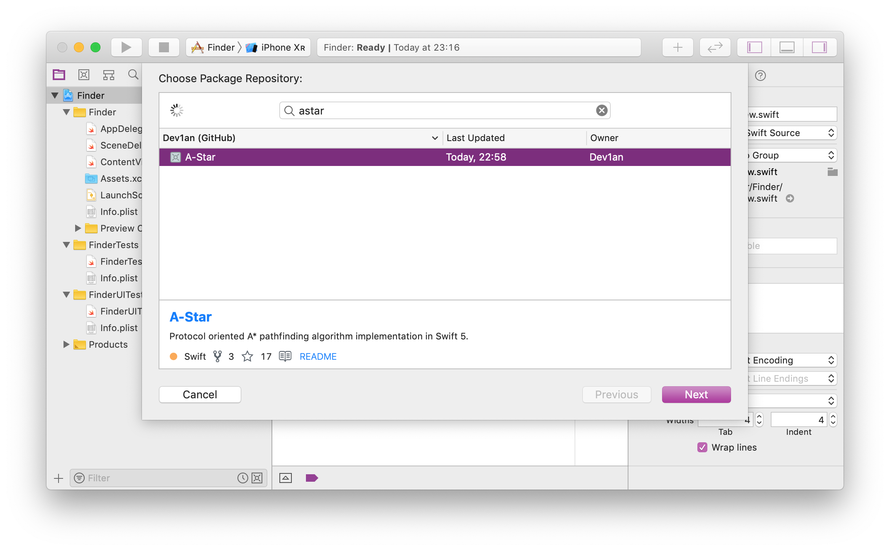

# A-Star
<a href="https://swift.org"></a> [](https://circleci.com/gh/Dev1an/A-Star/tree/master)

A* (A star) pathfinding algorithm implementation in Swift 5.0 (Playground included) using protocol oriented programming.

Add pathfinding to your graph just by implementing the 3 requirements of the [GraphNode protocol](https://dev1an.github.io/A-Star/Protocols/GraphNode.html).

## Playground

- To try the playground open: AStar.xcodeproj
- Build the framework (`command` + `b`)
- Click on Playground.playground


## Swift Package Manager

You can now add this package to your project using SPM 🎉

### Using Xcode

Xcode 11 has a new interface to include packages into your existing projects.

- Click `File` → `Swift Packages` → `Add Package Dependency...`
- Search for `AStar` and select this repository.
- Follow the on screen instructions



### Manualy editing package file

To include it in your package manually, add the following dependency to your `Package.swift` file.

```swift
.package(url: "https://github.com/Dev1an/A-Star.git", .branch("master"))
```

Use `import AStar` to access the APIs.
