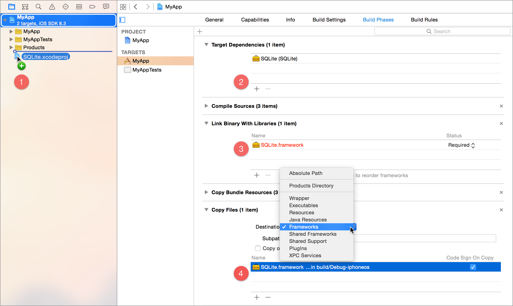

# SQLite.swift Documentation

  - [Installation](#installation)
    - [Carthage](#carthage)
    - [CocoaPods](#cocoapods)
    - [Swift Package Manager](#swift-package-manager)
    - [Manual](#manual)
  - [Getting Started](#getting-started)
    - [Connecting to a Database](#connecting-to-a-database)
      - [Read-Write Databases](#read-write-databases)
      - [Read-Only Databases](#read-only-databases)
      - [In-Memory Databases](#in-memory-databases)
      - [Thread-Safety](#thread-safety)
  - [Building Type-Safe SQL](#building-type-safe-sql)
    - [Expressions](#expressions)
      - [Compound Expressions](#compound-expressions)
    - [Queries](#queries)
  - [Creating a Table](#creating-a-table)
    - [Create Table Options](#create-table-options)
    - [Column Constraints](#column-constraints)
    - [Table Constraints](#table-constraints)
  - [Inserting Rows](#inserting-rows)
    - [Setters](#setters)
  - [Selecting Rows](#selecting-rows)
    - [Iterating and Accessing Values](#iterating-and-accessing-values)
    - [Plucking Rows](#plucking-rows)
    - [Building Complex Queries](#building-complex-queries)
      - [Selecting Columns](#selecting-columns)
      - [Joining Other Tables](#joining-other-tables)
        - [Column Namespacing](#column-namespacing)
        - [Table Aliasing](#table-aliasing)
      - [Filtering Rows](#filtering-rows)
        - [Filter Operators and Functions](#filter-operators-and-functions)
      - [Sorting Rows](#sorting-rows)
      - [Limiting and Paging Results](#limiting-and-paging-results)
      - [Aggregation](#aggregation)
  - [Updating Rows](#updating-rows)
  - [Deleting Rows](#deleting-rows)
  - [Transactions and Savepoints](#transactions-and-savepoints)
  - [Altering the Schema](#altering-the-schema)
    - [Renaming Tables](#renaming-tables)
    - [Adding Columns](#adding-columns)
      - [Added Column Constraints](#added-column-constraints)
    - [Indexes](#indexes)
      - [Creating Indexes](#creating-indexes)
      - [Dropping Indexes](#dropping-indexes)
    - [Dropping Tables](#dropping-tables)
    - [Migrations and Schema Versioning](#migrations-and-schema-versioning)
  - [Custom Types](#custom-types)
    - [Date-Time Values](#date-time-values)
    - [Binary Data](#binary-data)
    - [Custom Type Caveats](#custom-type-caveats)
  - [Other Operators](#other-operators)
  - [Core SQLite Functions](#core-sqlite-functions)
  - [Aggregate SQLite Functions](#aggregate-sqlite-functions)
  - [Custom SQL Functions](#custom-sql-functions)
  - [Custom Collations](#custom-collations)
  - [Full-text Search](#full-text-search)
  - [Executing Arbitrary SQL](#executing-arbitrary-sql)
  - [Logging](#logging)


[↩]: #sqliteswift-documentation


## Installation

> _Note:_ SQLite.swift requires Swift 3 (and [Xcode 8](https://developer.apple.com/xcode/downloads/)) or greater.


### Carthage

[Carthage][] is a simple, decentralized dependency manager for Cocoa. To
install SQLite.swift with Carthage:

 1. Make sure Carthage is [installed][Carthage Installation].

 2. Update your Cartfile to include the following:

    ```
    github "stephencelis/SQLite.swift" ~> 0.11.2
    ```

 3. Run `carthage update` and [add the appropriate framework][Carthage Usage].


[Carthage]: https://github.com/Carthage/Carthage
[Carthage Installation]: https://github.com/Carthage/Carthage#installing-carthage
[Carthage Usage]: https://github.com/Carthage/Carthage#adding-frameworks-to-an-application


### CocoaPods

[CocoaPods][] is a dependency manager for Cocoa projects. To install SQLite.swift with CocoaPods:

 1. Verify that your copy of Xcode is installed and active in the default location (`/Applications/Xcode.app`).

    ```sh
    sudo xcode-select --switch /Applications/Xcode.app
    ```

 2. Make sure CocoaPods is [installed][CocoaPods Installation] (SQLite.swift requires version 1.0.0 or greater).

    ``` sh
    # Using the default Ruby install will require you to use sudo when
    # installing and updating gems.
    [sudo] gem install cocoapods
    ```

 3. Update your Podfile to include the following:

    ``` ruby
    use_frameworks!

    target 'YourAppTargetName' do
        pod 'SQLite.swift', '~> 0.11.2'
    end
    ```

 4. Run `pod install --repo-update`.


#### Requiring a specific version of SQLite

 If you want to use a more recent version of SQLite than what is provided with the OS you can require the `standalone` subspec:

``` ruby
target 'YourAppTargetName' do
  pod 'SQLite.swift/standalone', '~> 0.11.2'
end
```

By default this will use the most recent version of SQLite without any extras. If you want you can further customize this by adding another dependency to sqlite3 or one of its subspecs:

``` ruby
target 'YourAppTargetName' do
  pod 'SQLite.swift/standalone', '~> 0.11.2'
  pod 'sqlite3/fts5', '= 3.15.0'  # SQLite 3.15.0 with FTS5 enabled
end
```

See the [sqlite3 podspec][sqlite3pod] for more details.

#### Using SQLite.swift with SQLCipher

If you want to use [SQLCipher][] with SQLite.swift you can require the `SQLCipher`
subspec in your Podfile:

``` ruby
target 'YourAppTargetName' do
  pod 'SQLite.swift/SQLCipher', '~> 0.11.2'
end
```

This will automatically add a dependency to the SQLCipher pod as well as extend
`Connection` with methods to change the database key:

``` swift
import SQLite

let db = try Connection("path/to/db.sqlite3")
try db.key("secret")
try db.rekey("another secret")
```

[CocoaPods]: https://cocoapods.org
[CocoaPods Installation]: https://guides.cocoapods.org/using/getting-started.html#getting-started
[sqlite3pod]: https://github.com/clemensg/sqlite3pod
[SQLCipher]: https://www.zetetic.net/sqlcipher/

### Swift Package Manager

The [Swift Package Manager][] is a tool for managing the distribution of Swift code.
It’s integrated with the Swift build system to automate the process of
downloading, compiling, and linking dependencies.

It is the recommended approach for using SQLite.swift in OSX CLI applications.

 1. Add the following to your `Package.swift` file:

  ``` swift
  dependencies: [
    .Package(url: "https://github.com/stephencelis/SQLite.swift.git", majorVersion: 0, minor: 11)
  ]
  ```

 2. Build your project:

  ``` sh
  $ swift build -Xlinker -lsqlite3
  ```

[Swift Package Manager]: https://swift.org/package-manager

### Manual

To install SQLite.swift as an Xcode sub-project:

 1. Drag the **SQLite.xcodeproj** file into your own project. ([Submodule](http://git-scm.com/book/en/Git-Tools-Submodules), clone, or [download](https://github.com/stephencelis/SQLite.swift/archive/master.zip) the project first.)

    

 2. In your target’s **General** tab, click the **+** button under **Linked Frameworks and Libraries**.

 3. Select the appropriate **SQLite.framework** for your platform.

 4. **Add**.

You should now be able to `import SQLite` from any of your target’s source files and begin using SQLite.swift.

Some additional steps are required to install the application on an actual device:

 5. In the **General** tab, click the **+** button under **Embedded Binaries**.

 6. Select the appropriate **SQLite.framework** for your platform.

 7. **Add**.

## Getting Started

To use SQLite.swift classes or structures in your target’s source file, first import the `SQLite` module.

``` swift
import SQLite
```


### Connecting to a Database

Database connections are established using the `Connection` class. A connection is initialized with a path to a database. SQLite will attempt to create the database file if it does not already exist.

``` swift
let db = try Connection("path/to/db.sqlite3")
```


#### Read-Write Databases

On iOS, you can create a writable database in your app’s **Documents** directory.

``` swift
let path = NSSearchPathForDirectoriesInDomains(
    .documentDirectory, .userDomainMask, true
).first!

let db = try Connection("\(path)/db.sqlite3")
```

On OS X, you can use your app’s **Application Support** directory:

``` swift
var path = NSSearchPathForDirectoriesInDomains(
    .applicationSupportDirectory, .userDomainMask, true
).first! + Bundle.main.bundleIdentifier!

// create parent directory iff it doesn’t exist
try FileManager.default.createDirectoryAtPath(
    path, withIntermediateDirectories: true, attributes: nil
)

let db = try Connection("\(path)/db.sqlite3")
```


#### Read-Only Databases

If you bundle a database with your app (_i.e._, you’ve copied a database file into your Xcode project and added it to your application target), you can establish a _read-only_ connection to it.

``` swift
let path = Bundle.main.pathForResource("db", ofType: "sqlite3")!

let db = try Connection(path, readonly: true)
```

> _Note:_ Signed applications cannot modify their bundle resources. If you bundle a database file with your app for the purpose of bootstrapping, copy it to a writable location _before_ establishing a connection (see [Read-Write Databases](#read-write-databases), above, for typical, writable locations).
>
> See these two Stack Overflow questions for more information about iOS apps with SQLite databases: [1](https://stackoverflow.com/questions/34609746/what-different-between-store-database-in-different-locations-in-ios), [2](https://stackoverflow.com/questions/34614968/ios-how-to-copy-pre-seeded-database-at-the-first-running-app-with-sqlite-swift). We welcome sample code to show how to successfully copy and use a bundled "seed" database for writing in an app.

#### In-Memory Databases

If you omit the path, SQLite.swift will provision an [in-memory database](https://www.sqlite.org/inmemorydb.html).

``` swift
let db = try Connection() // equivalent to `Connection(.inMemory)`
```

To create a temporary, disk-backed database, pass an empty file name.

``` swift
let db = try Connection(.temporary)
```

In-memory databases are automatically deleted when the database connection is closed.


#### Thread-Safety

Every Connection comes equipped with its own serial queue for statement execution and can be safely accessed across threads. Threads that open transactions and savepoints will block other threads from executing statements while the transaction is open.

If you maintain multiple connections for a single database, consider setting a timeout (in seconds) and/or a busy handler:

```swift
db.busyTimeout = 5

db.busyHandler({ tries in
    if tries >= 3 {
        return false
    }
    return true
})
```

> _Note:_ The default timeout is 0, so if you see `database is locked` errors, you may be trying to access the same database simultaneously from multiple connections.


## Building Type-Safe SQL

SQLite.swift comes with a typed expression layer that directly maps [Swift types](https://developer.apple.com/library/prerelease/ios/documentation/General/Reference/SwiftStandardLibraryReference/) to their [SQLite counterparts](https://www.sqlite.org/datatype3.html).

| Swift Type      | SQLite Type |
| --------------- | ----------- |
| `Int64`*        | `INTEGER`   |
| `Double`        | `REAL`      |
| `String`        | `TEXT`      |
| `nil`           | `NULL`      |
| `SQLite.Blob`†  | `BLOB`      |

> *While `Int64` is the basic, raw type (to preserve 64-bit integers on 32-bit platforms), `Int` and `Bool` work transparently.
>
> †SQLite.swift defines its own `Blob` structure, which safely wraps the underlying bytes.
>
> See [Custom Types](#custom-types) for more information about extending other classes and structures to work with SQLite.swift.
>
> See [Executing Arbitrary SQL](#executing-arbitrary-sql) to forego the typed layer and execute raw SQL, instead.

These expressions (in the form of the structure, [`Expression`](#expressions)) build on one another and, with a query ([`QueryType`](#queries)), can create and execute SQL statements.


### Expressions

Expressions are generic structures associated with a type ([built-in](#building-type-safe-sql) or [custom](#custom-types)), raw SQL, and (optionally) values to bind to that SQL. Typically, you will only explicitly create expressions to describe your columns, and typically only once per column.

``` swift
let id = Expression<Int64>("id")
let email = Expression<String>("email")
let balance = Expression<Double>("balance")
let verified = Expression<Bool>("verified")
```

Use optional generics for expressions that can evaluate to `NULL`.

``` swift
let name = Expression<String?>("name")
```

> _Note:_ The default `Expression` initializer is for [quoted identifiers](https://www.sqlite.org/lang_keywords.html) (_i.e._, column names). To build a literal SQL expression, use `init(literal:)`. <!-- FIXME -->


### Compound Expressions

Expressions can be combined with other expressions and types using [filter operators and functions](#filter-operators-and-functions) (as well as other [non-filter operators](#other-operators) and [functions](#core-sqlite-functions)). These building blocks can create complex SQLite statements.


### Queries

Queries are structures that reference a database and table name, and can be used to build a variety of statements using expressions. We can create a query by initializing a `Table`, `View`, or `VirtualTable`.

``` swift
let users = Table("users")
```

Assuming [the table exists](#creating-a-table), we can immediately [insert](#inserting-rows), [select](#selecting-rows), [update](#updating-rows), and [delete](#deleting-rows) rows.


## Creating a Table

We can build [`CREATE TABLE` statements](https://www.sqlite.org/lang_createtable.html) by calling the `create` function on a `Table`. The following is a basic example of SQLite.swift code (using the [expressions](#expressions) and [query](#queries) above) and the corresponding SQL it generates.

``` swift
try db.run(users.create { t in     // CREATE TABLE "users" (
    t.column(id, primaryKey: true) //     "id" INTEGER PRIMARY KEY NOT NULL,
    t.column(email, unique: true)  //     "email" TEXT UNIQUE NOT NULL,
    t.column(name)                 //     "name" TEXT
})                                 // )
```

> _Note:_ `Expression<T>` structures (in this case, the `id` and `email` columns), generate `NOT NULL` constraints automatically, while `Expression<T?>` structures (`name`) do not.


### Create Table Options

The `Table.create` function has several default parameters we can override.

  - `temporary` adds a `TEMPORARY` clause to the `CREATE TABLE` statement (to create a temporary table that will automatically drop when the database connection closes). Default: `false`.

    ``` swift
    try db.run(users.create(temporary: true) { t in /* ... */ })
    // CREATE TEMPORARY TABLE "users" -- ...
    ```

  - `ifNotExists` adds an `IF NOT EXISTS` clause to the `CREATE TABLE` statement (which will bail out gracefully if the table already exists). Default: `false`.

    ``` swift
    try db.run(users.create(ifNotExists: true) { t in /* ... */ })
    // CREATE TABLE "users" IF NOT EXISTS -- ...
    ```

### Column Constraints

The `column` function is used for a single column definition. It takes an [expression](#expressions) describing the column name and type, and accepts several parameters that map to various column constraints and clauses.

  - `primaryKey` adds a `PRIMARY KEY` constraint to a single column.

    ``` swift
    t.column(id, primaryKey: true)
    // "id" INTEGER PRIMARY KEY NOT NULL

    t.column(id, primaryKey: .autoincrement)
    // "id" INTEGER PRIMARY KEY AUTOINCREMENT NOT NULL
    ```

    > _Note:_ The `primaryKey` parameter cannot be used alongside `references`. If you need to create a column that has a default value and is also a primary and/or foreign key, use the `primaryKey` and `foreignKey` functions mentioned under [Table Constraints](#table-constraints).
    >
    > Primary keys cannot be optional (_e.g._, `Expression<Int64?>`).
    >
    > Only an `INTEGER PRIMARY KEY` can take `.autoincrement`.

  - `unique` adds a `UNIQUE` constraint to the column. (See the `unique` function under [Table Constraints](#table-constraints) for uniqueness over multiple columns).

    ``` swift
    t.column(email, unique: true)
    // "email" TEXT UNIQUE NOT NULL
    ```

  - `check` attaches a `CHECK` constraint to a column definition in the form of a boolean expression (`Expression<Bool>`). Boolean expressions can be easily built using [filter operators and functions](#filter-operators-and-functions). (See also the `check` function under [Table Constraints](#table-constraints).)

    ``` swift
    t.column(email, check: email.like("%@%"))
    // "email" TEXT NOT NULL CHECK ("email" LIKE '%@%')
    ```

  - `defaultValue` adds a `DEFAULT` clause to a column definition and _only_ accepts a value (or expression) matching the column’s type. This value is used if none is explicitly provided during [an `INSERT`](#inserting-rows).

    ``` swift
    t.column(name, defaultValue: "Anonymous")
    // "name" TEXT DEFAULT 'Anonymous'
    ```

    > _Note:_ The `defaultValue` parameter cannot be used alongside `primaryKey` and `references`. If you need to create a column that has a default value and is also a primary and/or foreign key, use the `primaryKey` and `foreignKey` functions mentioned under [Table Constraints](#table-constraints).

  - `collate` adds a `COLLATE` clause to `Expression<String>` (and `Expression<String?>`) column definitions with [a collating sequence](https://www.sqlite.org/datatype3.html#collation) defined in the `Collation` enumeration.

    ``` swift
    t.column(email, collate: .nocase)
    // "email" TEXT NOT NULL COLLATE "NOCASE"

    t.column(name, collate: .rtrim)
    // "name" TEXT COLLATE "RTRIM"
    ```

  - `references` adds a `REFERENCES` clause to `Expression<Int64>` (and `Expression<Int64?>`) column definitions and accepts a table (`SchemaType`) or namespaced column expression. (See the `foreignKey` function under [Table Constraints](#table-constraints) for non-integer foreign key support.)

    ``` swift
    t.column(user_id, references: users, id)
    // "user_id" INTEGER REFERENCES "users" ("id")

<!-- TODO: restore functionality?
    t.column(user_id, references: users)
    // "user_id" INTEGER REFERENCES "users"
    // -- assumes "users" has a PRIMARY KEY
    ```
-->

    > _Note:_ The `references` parameter cannot be used alongside `primaryKey` and `defaultValue`. If you need to create a column that has a default value and is also a primary and/or foreign key, use the `primaryKey` and `foreignKey` functions mentioned under [Table Constraints](#table-constraints).


### Table Constraints

Additional constraints may be provided outside the scope of a single column using the following functions.

  - `primaryKey` adds a `PRIMARY KEY` constraint to the table. Unlike [the column constraint, above](#column-constraints), it supports all SQLite types, [ascending and descending orders](#sorting-rows), and composite (multiple column) keys.

    ``` swift
    t.primaryKey(email.asc, name)
    // PRIMARY KEY("email" ASC, "name")
    ```

  - `unique` adds a `UNIQUE` constraint to the table. Unlike [the column constraint, above](#column-constraints), it supports composite (multiple column) constraints.

    ``` swift
    t.unique(local, domain)
    // UNIQUE("local", "domain")
    ```

  - `check` adds a `CHECK` constraint to the table in the form of a boolean expression (`Expression<Bool>`). Boolean expressions can be easily built using [filter operators and functions](#filter-operators-and-functions). (See also the `check` parameter under [Column Constraints](#column-constraints).)

    ``` swift
    t.check(balance >= 0)
    // CHECK ("balance" >= 0.0)
    ```

  - `foreignKey` adds a `FOREIGN KEY` constraint to the table. Unlike [the `references` constraint, above](#column-constraints), it supports all SQLite types, both [`ON UPDATE` and `ON DELETE` actions](https://www.sqlite.org/foreignkeys.html#fk_actions), and composite (multiple column) keys.

    ``` swift
    t.foreignKey(user_id, references: users, id, delete: .setNull)
    // FOREIGN KEY("user_id") REFERENCES "users"("id") ON DELETE SET NULL
    ```

<!-- TODO
### Creating a Table from a Select Statement
-->


## Inserting Rows

We can insert rows into a table by calling a [query’s](#queries) `insert` function with a list of [setters](#setters)—typically [typed column expressions](#expressions) and values (which can also be expressions)—each joined by the `<-` operator.

``` swift
try db.run(users.insert(email <- "alice@mac.com", name <- "Alice"))
// INSERT INTO "users" ("email", "name") VALUES ('alice@mac.com', 'Alice')

try db.run(users.insert(or: .replace, email <- "alice@mac.com", name <- "Alice B."))
// INSERT OR REPLACE INTO "users" ("email", "name") VALUES ('alice@mac.com', 'Alice B.')
```

The `insert` function, when run successfully, returns an `Int64` representing the inserted row’s [`ROWID`][ROWID].

``` swift
do {
    let rowid = try db.run(users.insert(email <- "alice@mac.com"))
    print("inserted id: \(rowid)")
} catch {
    print("insertion failed: \(error)")
}
```

The [`update`](#updating-rows) and [`delete`](#deleting-rows) functions follow similar patterns.

> _Note:_ If `insert` is called without any arguments, the statement will run with a `DEFAULT VALUES` clause. The table must not have any constraints that aren’t fulfilled by default values.
>
> ``` swift
> try db.run(timestamps.insert())
> // INSERT INTO "timestamps" DEFAULT VALUES
> ```


### Setters

SQLite.swift typically uses the `<-` operator to set values during [inserts](#inserting-rows) and [updates](#updating-rows).

``` swift
try db.run(counter.update(count <- 0))
// UPDATE "counters" SET "count" = 0 WHERE ("id" = 1)
```

There are also a number of convenience setters that take the existing value into account using native Swift operators.

For example, to atomically increment a column, we can use `++`:

``` swift
try db.run(counter.update(count++)) // equivalent to `counter.update(count -> count + 1)`
// UPDATE "counters" SET "count" = "count" + 1 WHERE ("id" = 1)
```

To take an amount and “move” it via transaction, we can use `-=` and `+=`:

``` swift
let amount = 100.0
try db.transaction {
    try db.run(alice.update(balance -= amount))
    try db.run(betty.update(balance += amount))
}
// BEGIN DEFERRED TRANSACTION
// UPDATE "users" SET "balance" = "balance" - 100.0 WHERE ("id" = 1)
// UPDATE "users" SET "balance" = "balance" + 100.0 WHERE ("id" = 2)
// COMMIT TRANSACTION
```


###### Infix Setters

| Operator | Types              |
| -------- | ------------------ |
| `<-`     | `Value -> Value`   |
| `+=`     | `Number -> Number` |
| `-=`     | `Number -> Number` |
| `*=`     | `Number -> Number` |
| `/=`     | `Number -> Number` |
| `%=`     | `Int -> Int`       |
| `<<=`    | `Int -> Int`       |
| `>>=`    | `Int -> Int`       |
| `&=`     | `Int -> Int`       |
| `||=`    | `Int -> Int`       |
| `^=`     | `Int -> Int`       |
| `+=`     | `String -> String` |


###### Postfix Setters

| Operator | Types        |
| -------- | ------------ |
| `++`     | `Int -> Int` |
| `--`     | `Int -> Int` |


## Selecting Rows

[Query structures](#queries) are `SELECT` statements waiting to happen. They execute via [iteration](#iterating-and-accessing-values) and [other means](#plucking-values) of sequence access.


### Iterating and Accessing Values

Prepared [queries](#queries) execute lazily upon iteration. Each row is returned as a `Row` object, which can be subscripted with a [column expression](#expressions) matching one of the columns returned.

``` swift
for user in try db.prepare(users) {
    print("id: \(user[id]), email: \(user[email]), name: \(user[name])")
    // id: 1, email: alice@mac.com, name: Optional("Alice")
}
// SELECT * FROM "users"
```

`Expression<T>` column values are _automatically unwrapped_ (we’ve made a promise to the compiler that they’ll never be `NULL`), while `Expression<T?>` values remain wrapped.


### Plucking Rows

We can pluck the first row by passing a query to the `pluck` function on a database connection.

``` swift
if let user = try db.pluck(users) { /* ... */ } // Row
// SELECT * FROM "users" LIMIT 1
```

To collect all rows into an array, we can simply wrap the sequence (though this is not always the most memory-efficient idea).

``` swift
let all = Array(try db.prepare(users))
// SELECT * FROM "users"
```


### Building Complex Queries

[Queries](#queries) have a number of chainable functions that can be used (with [expressions](#expressions)) to add and modify [a number of clauses](https://www.sqlite.org/lang_select.html) to the underlying statement.

``` swift
let query = users.select(email)           // SELECT "email" FROM "users"
                 .filter(name != nil)     // WHERE "name" IS NOT NULL
                 .order(email.desc, name) // ORDER BY "email" DESC, "name"
                 .limit(5, offset: 1)     // LIMIT 5 OFFSET 1
```


#### Selecting Columns

By default, [queries](#queries) select every column of the result set (using `SELECT *`). We can use the `select` function with a list of [expressions](#expressions) to return specific columns instead.

``` swift
for user in try db.prepare(users.select(id, email)) {
    print("id: \(user[id]), email: \(user[email])")
    // id: 1, email: alice@mac.com
}
// SELECT "id", "email" FROM "users"
```

We can access the results of more complex expressions by holding onto a reference of the expression itself.

``` swift
let sentence = name + " is " + cast(age) as Expression<String?> + " years old!"
for user in users.select(sentence) {
    print(user[sentence])
    // Optional("Alice is 30 years old!")
}
// SELECT ((("name" || ' is ') || CAST ("age" AS TEXT)) || ' years old!') FROM "users"
```


#### Joining Other Tables

We can join tables using a [query’s](#queries) `join` function.

``` swift
users.join(posts, on: user_id == users[id])
// SELECT * FROM "users" INNER JOIN "posts" ON ("user_id" = "users"."id")
```

The `join` function takes a [query](#queries) object (for the table being joined on), a join condition (`on`), and is prefixed with an optional join type (default: `.inner`). Join conditions can be built using [filter operators and functions](#filter-operators-and-functions), generally require [namespacing](#column-namespacing), and sometimes require [aliasing](#table-aliasing).


##### Column Namespacing

When joining tables, column names can become ambiguous. _E.g._, both tables may have an `id` column.

``` swift
let query = users.join(posts, on: user_id == id)
// assertion failure: ambiguous column 'id'
```

We can disambiguate by namespacing `id`.

``` swift
let query = users.join(posts, on: user_id == users[id])
// SELECT * FROM "users" INNER JOIN "posts" ON ("user_id" = "users"."id")
```

Namespacing is achieved by subscripting a [query](#queries) with a [column expression](#expressions) (_e.g._, `users[id]` above becomes `users.id`).

> _Note:_ We can namespace all of a table’s columns using `*`.
>
> ``` swift
> let query = users.select(users[*])
> // SELECT "users".* FROM "users"
> ```


##### Table Aliasing

Occasionally, we need to join a table to itself, in which case we must alias the table with another name. We can achieve this using the [query’s](#queries) `alias` function.

``` swift
let managers = users.alias("managers")

let query = users.join(managers, on: managers[id] == users[managerId])
// SELECT * FROM "users"
// INNER JOIN ("users") AS "managers" ON ("managers"."id" = "users"."manager_id")
```

If query results can have ambiguous column names, row values should be accessed with namespaced [column expressions](#expressions). In the above case, `SELECT *` immediately namespaces all columns of the result set.

``` swift
let user = try db.pluck(query)
user[id]           // fatal error: ambiguous column 'id'
                   // (please disambiguate: ["users"."id", "managers"."id"])

user[users[id]]    // returns "users"."id"
user[managers[id]] // returns "managers"."id"
```


#### Filtering Rows

SQLite.swift filters rows using a [query’s](#queries) `filter` function with a boolean [expression](#expressions) (`Expression<Bool>`).

``` swift
users.filter(id == 1)
// SELECT * FROM "users" WHERE ("id" = 1)

users.filter([1, 2, 3, 4, 5].contains(id))
// SELECT * FROM "users" WHERE ("id" IN (1, 2, 3, 4, 5))

users.filter(email.like("%@mac.com"))
// SELECT * FROM "users" WHERE ("email" LIKE '%@mac.com')

users.filter(verified && name.lowercaseString == "alice")
// SELECT * FROM "users" WHERE ("verified" AND (lower("name") == 'alice'))

users.filter(verified || balance >= 10_000)
// SELECT * FROM "users" WHERE ("verified" OR ("balance" >= 10000.0))
```

We can build our own boolean expressions by using one of the many [filter operators and functions](#filter-operators-and-functions).

Instead of `filter` we can also use the `where` function which is an alias:

``` swift
users.where(id == 1)
// SELECT * FROM "users" WHERE ("id" = 1)
```

##### Filter Operators and Functions

SQLite.swift defines a number of operators for building filtering predicates. Operators and functions work together in a type-safe manner, so attempting to equate or compare different types will prevent compilation.


###### Infix Filter Operators

| Swift | Types                            | SQLite         |
| ----- | -------------------------------- | -------------- |
| `==`  | `Equatable -> Bool`              | `=`/`IS`*      |
| `!=`  | `Equatable -> Bool`              | `!=`/`IS NOT`* |
| `>`   | `Comparable -> Bool`             | `>`            |
| `>=`  | `Comparable -> Bool`             | `>=`           |
| `<`   | `Comparable -> Bool`             | `<`            |
| `<=`  | `Comparable -> Bool`             | `<=`           |
| `~=`  | `(Interval, Comparable) -> Bool` | `BETWEEN`      |
| `&&`  | `Bool -> Bool`                   | `AND`          |
| `||`  | `Bool -> Bool`                   | `OR`           |

> *When comparing against `nil`, SQLite.swift will use `IS` and `IS NOT` accordingly.


###### Prefix Filter Operators

| Swift | Types              | SQLite |
| ----- | ------------------ | ------ |
| `!`   | `Bool -> Bool`     | `NOT`  |


###### Filtering Functions

| Swift      | Types                   | SQLite  |
| ---------- | ----------------------- | ------- |
| `like`     | `String -> Bool`        | `LIKE`  |
| `glob`     | `String -> Bool`        | `GLOB`  |
| `match`    | `String -> Bool`        | `MATCH` |
| `contains` | `(Array<T>, T) -> Bool` | `IN`    |


<!-- TODO
#### Grouping Results
-->


#### Sorting Rows

We can pre-sort returned rows using the [query’s](#queries) `order` function.

_E.g._, to return users sorted by `email`, then `name`, in ascending order:

``` swift
users.order(email, name)
// SELECT * FROM "users" ORDER BY "email", "name"
```

The `order` function takes a list of [column expressions](#expressions).

`Expression` objects have two computed properties to assist sorting: `asc` and `desc`. These properties append the expression with `ASC` and `DESC` to mark ascending and descending order respectively.

``` swift
users.order(email.desc, name.asc)
// SELECT * FROM "users" ORDER BY "email" DESC, "name" ASC
```


#### Limiting and Paging Results

We can limit and skip returned rows using a [query’s](#queries) `limit` function (and its optional `offset` parameter).

``` swift
users.limit(5)
// SELECT * FROM "users" LIMIT 5

users.limit(5, offset: 5)
// SELECT * FROM "users" LIMIT 5 OFFSET 5
```


#### Aggregation

[Queries](#queries) come with a number of functions that quickly return aggregate scalar values from the table. These mirror the [core aggregate functions](#aggregate-sqlite-functions) and are executed immediately against the query.

``` swift
let count = try db.scalar(users.count)
// SELECT count(*) FROM "users"
```

Filtered queries will appropriately filter aggregate values.

``` swift
let count = try db.scalar(users.filter(name != nil).count)
// SELECT count(*) FROM "users" WHERE "name" IS NOT NULL
```

  - `count` as a computed property on a query (see examples above) returns the total number of rows matching the query.

    `count` as a computed property on a column expression returns the total number of rows where that column is not `NULL`.

    ``` swift
    let count = try db.scalar(users.select(name.count)) // -> Int
    // SELECT count("name") FROM "users"
    ```

  - `max` takes a comparable column expression and returns the largest value if any exists.

    ``` swift
    let max = try db.scalar(users.select(id.max)) // -> Int64?
    // SELECT max("id") FROM "users"
    ```

  - `min` takes a comparable column expression and returns the smallest value if any exists.

    ``` swift
    let min = try db.scalar(users.select(id.min)) // -> Int64?
    // SELECT min("id") FROM "users"
    ```

  - `average` takes a numeric column expression and returns the average row value (as a `Double`) if any exists.

    ``` swift
    let average = try db.scalar(users.select(balance.average)) // -> Double?
    // SELECT avg("balance") FROM "users"
    ```

  - `sum` takes a numeric column expression and returns the sum total of all rows if any exist.

    ``` swift
    let sum = try db.scalar(users.select(balance.sum)) // -> Double?
    // SELECT sum("balance") FROM "users"
    ```

  - `total`, like `sum`, takes a numeric column expression and returns the sum total of all rows, but in this case always returns a `Double`, and returns `0.0` for an empty query.

    ``` swift
    let total = try db.scalar(users.select(balance.total)) // -> Double
    // SELECT total("balance") FROM "users"
    ```

> _Note:_ Expressions can be prefixed with a `DISTINCT` clause by calling the `distinct` computed property.
>
> ``` swift
> let count = try db.scalar(users.select(name.distinct.count) // -> Int
> // SELECT count(DISTINCT "name") FROM "users"
> ```


## Updating Rows

We can update a table’s rows by calling a [query’s](#queries) `update` function with a list of [setters](#setters)—typically [typed column expressions](#expressions) and values (which can also be expressions)—each joined by the `<-` operator.

When an unscoped query calls `update`, it will update _every_ row in the table.

``` swift
try db.run(users.update(email <- "alice@me.com"))
// UPDATE "users" SET "email" = 'alice@me.com'
```

Be sure to scope `UPDATE` statements beforehand using [the `filter` function](#filtering-rows).

``` swift
let alice = users.filter(id == 1)
try db.run(alice.update(email <- "alice@me.com"))
// UPDATE "users" SET "email" = 'alice@me.com' WHERE ("id" = 1)
```

The `update` function returns an `Int` representing the number of updated rows.

``` swift
do {
    if try db.run(alice.update(email <- "alice@me.com")) > 0 {
        print("updated alice")
    } else {
        print("alice not found")
    }
} catch {
    print("update failed: \(error)")
}
```


## Deleting Rows

We can delete rows from a table by calling a [query’s](#queries) `delete` function.

When an unscoped query calls `delete`, it will delete _every_ row in the table.

``` swift
try db.run(users.delete())
// DELETE FROM "users"
```

Be sure to scope `DELETE` statements beforehand using [the `filter` function](#filtering-rows).

``` swift
let alice = users.filter(id == 1)
try db.run(alice.delete())
// DELETE FROM "users" WHERE ("id" = 1)
```

The `delete` function returns an `Int` representing the number of deleted rows.

``` swift
do {
    if try db.run(alice.delete()) > 0 {
        print("deleted alice")
    } else {
        print("alice not found")
    }
} catch {
    print("delete failed: \(error)")
}
```


## Transactions and Savepoints

Using the `transaction` and `savepoint` functions, we can run a series of statements in a transaction. If a single statement fails or the block throws an error, the changes will be rolled back.

``` swift
try db.transaction {
    let rowid = try db.run(users.insert(email <- "betty@icloud.com"))
    try db.run(users.insert(email <- "cathy@icloud.com", managerId <- rowid))
}
// BEGIN DEFERRED TRANSACTION
// INSERT INTO "users" ("email") VALUES ('betty@icloud.com')
// INSERT INTO "users" ("email", "manager_id") VALUES ('cathy@icloud.com', 2)
// COMMIT TRANSACTION
```

> _Note:_ Transactions run in a serial queue.


## Altering the Schema

SQLite.swift comes with several functions (in addition to `Table.create`) for altering a database schema in a type-safe manner.


### Renaming Tables

We can build an `ALTER TABLE … RENAME TO` statement by calling the `rename` function on a `Table` or `VirtualTable`.

``` swift
try db.run(users.rename(Table("users_old"))
// ALTER TABLE "users" RENAME TO "users_old"
```


### Adding Columns

We can add columns to a table by calling `addColumn` function on a `Table`. SQLite.swift enforces [the same limited subset](https://www.sqlite.org/lang_altertable.html) of `ALTER TABLE` that SQLite supports.

``` swift
try db.run(users.addColumn(suffix))
// ALTER TABLE "users" ADD COLUMN "suffix" TEXT
```


#### Added Column Constraints

The `addColumn` function shares several of the same [`column` function parameters](#column-constraints) used when [creating tables](#creating-a-table).

  - `check` attaches a `CHECK` constraint to a column definition in the form of a boolean expression (`Expression<Bool>`). (See also the `check` function under [Table Constraints](#table-constraints).)

    ``` swift
    try db.run(users.addColumn(suffix, check: ["JR", "SR"].contains(suffix)))
    // ALTER TABLE "users" ADD COLUMN "suffix" TEXT CHECK ("suffix" IN ('JR', 'SR'))
    ```

  - `defaultValue` adds a `DEFAULT` clause to a column definition and _only_ accepts a value matching the column’s type. This value is used if none is explicitly provided during [an `INSERT`](#inserting-rows).

    ``` swift
    try db.run(users.addColumn(suffix, defaultValue: "SR"))
    // ALTER TABLE "users" ADD COLUMN "suffix" TEXT DEFAULT 'SR'
    ```

    > _Note:_ Unlike the [`CREATE TABLE` constraint](#table-constraints), default values may not be expression structures (including `CURRENT_TIME`, `CURRENT_DATE`, or `CURRENT_TIMESTAMP`).

  - `collate` adds a `COLLATE` clause to `Expression<String>` (and `Expression<String?>`) column definitions with [a collating sequence](https://www.sqlite.org/datatype3.html#collation) defined in the `Collation` enumeration.

    ``` swift
    try db.run(users.addColumn(email, collate: .nocase))
    // ALTER TABLE "users" ADD COLUMN "email" TEXT NOT NULL COLLATE "NOCASE"

    try db.run(users.addColumn(name, collate: .rtrim))
    // ALTER TABLE "users" ADD COLUMN "name" TEXT COLLATE "RTRIM"
    ```

  - `references` adds a `REFERENCES` clause to `Int64` (and `Int64?`) column definitions and accepts a table or namespaced column expression. (See the `foreignKey` function under [Table Constraints](#table-constraints) for non-integer foreign key support.)

    ``` swift
    try db.run(posts.addColumn(userId, references: users, id)
    // ALTER TABLE "posts" ADD COLUMN "user_id" INTEGER REFERENCES "users" ("id")
    ```


### Indexes


#### Creating Indexes

We can build [`CREATE INDEX` statements](https://www.sqlite.org/lang_createindex.html) by calling the `createIndex` function on a `SchemaType`.

``` swift
try db.run(users.createIndex(email))
// CREATE INDEX "index_users_on_email" ON "users" ("email")
```

The index name is generated automatically based on the table and column names.

The `createIndex` function has a couple default parameters we can override.

  - `unique` adds a `UNIQUE` constraint to the index. Default: `false`.

    ``` swift
    try db.run(users.createIndex(email, unique: true))
    // CREATE UNIQUE INDEX "index_users_on_email" ON "users" ("email")
    ```

  - `ifNotExists` adds an `IF NOT EXISTS` clause to the `CREATE TABLE` statement (which will bail out gracefully if the table already exists). Default: `false`.

    ``` swift
    try db.run(users.createIndex(email, ifNotExists: true))
    // CREATE INDEX IF NOT EXISTS "index_users_on_email" ON "users" ("email")
    ```


#### Dropping Indexes

We can build [`DROP INDEX` statements](https://www.sqlite.org/lang_dropindex.html) by calling the `dropIndex` function on a `SchemaType`.

``` swift
try db.run(users.dropIndex(email))
// DROP INDEX "index_users_on_email"
```

The `dropIndex` function has one additional parameter, `ifExists`, which (when `true`) adds an `IF EXISTS` clause to the statement.

``` swift
try db.run(users.dropIndex(email, ifExists: true))
// DROP INDEX IF EXISTS "index_users_on_email"
```


### Dropping Tables

We can build [`DROP TABLE` statements](https://www.sqlite.org/lang_droptable.html) by calling the `dropTable` function on a `SchemaType`.

``` swift
try db.run(users.drop())
// DROP TABLE "users"
```

The `drop` function has one additional parameter, `ifExists`, which (when `true`) adds an `IF EXISTS` clause to the statement.

``` swift
try db.run(users.drop(ifExists: true))
// DROP TABLE IF EXISTS "users"
```


### Migrations and Schema Versioning

You can add a convenience property on `Connection` to query and set the [`PRAGMA user_version`](https://sqlite.org/pragma.html#pragma_user_version).

This is a great way to manage your schema’s version over migrations.

``` swift
extension Connection {
    public var userVersion: Int32 {
        get { return Int32(try! scalar("PRAGMA user_version") as! Int64)}
        set { try! run("PRAGMA user_version = \(newValue)") }
    }
}
```

Then you can conditionally run your migrations along the lines of:

```swift
if db.userVersion == 0 {
    // handle first migration
    db.userVersion = 1
}
if db.userVersion == 1 {
    // handle second migration
    db.userVersion = 2
}
```

For more complex migration requirements check out the schema management system
[SQLiteMigrationManager.swift][].

## Custom Types

SQLite.swift supports serializing and deserializing any custom type as long as it conforms to the `Value` protocol.

> ``` swift
> protocol Value {
>     typealias Datatype: Binding
>     class var declaredDatatype: String { get }
>     class func fromDatatypeValue(datatypeValue: Datatype) -> Self
>     var datatypeValue: Datatype { get }
> }
> ```

The `Datatype` must be one of the basic Swift types that values are bridged through before serialization and deserialization (see [Building Type-Safe SQL](#building-type-safe-sql) for a list of types).

> _Note:_ `Binding` is a protocol that SQLite.swift uses internally to directly map SQLite types to Swift types. **Do _not_** conform custom types to the `Binding` protocol.

Once extended, the type can be used [_almost_](#custom-type-caveats) wherever typed expressions can be.


### Date-Time Values

In SQLite, `DATETIME` columns can be treated as strings or numbers, so we can transparently bridge `Date` objects through Swift’s `String` or `Int` types.

To serialize `Date` objects as `TEXT` values (in ISO 8601), we’ll use `String`.

``` swift
extension Date: Value {
    class var declaredDatatype: String {
        return String.declaredDatatype
    }
    class func fromDatatypeValue(stringValue: String) -> Date {
        return SQLDateFormatter.dateFromString(stringValue)!
    }
    var datatypeValue: String {
        return SQLDateFormatter.stringFromDate(self)
    }
}

let SQLDateFormatter: DateFormatter = {
    let formatter = DateFormatter()
    formatter.dateFormat = "yyyy-MM-dd'T'HH:mm:ss.SSS"
    formatter.locale = Locale(localeIdentifier: "en_US_POSIX")
    formatter.timeZone = TimeZone(forSecondsFromGMT: 0)
    return formatter
}()
```

We can also treat them as `INTEGER` values using `Int`.

``` swift
extension Date: Value {
    class var declaredDatatype: String {
        return Int.declaredDatatype
    }
    class func fromDatatypeValue(intValue: Int) -> Self {
        return self(timeIntervalSince1970: TimeInterval(intValue))
    }
    var datatypeValue: Int {
        return Int(timeIntervalSince1970)
    }
}
```

> _Note:_ SQLite’s `CURRENT_DATE`, `CURRENT_TIME`, and `CURRENT_TIMESTAMP` helpers return `TEXT` values. Because of this (and the fact that Unix time is far less human-readable when we’re faced with the raw data), we recommend using the `TEXT` extension.

Once defined, we can use these types directly in SQLite statements.

``` swift
let published_at = Expression<Date>("published_at")

let published = posts.filter(published_at <= Date())
// extension where Datatype == String:
//     SELECT * FROM "posts" WHERE "published_at" <= '2014-11-18 12:45:30'
// extension where Datatype == Int:
//     SELECT * FROM "posts" WHERE "published_at" <= 1416314730
```


### Binary Data

We can bridge any type that can be initialized from and encoded to `Data`.

``` swift
extension UIImage: Value {
    public class var declaredDatatype: String {
        return Blob.declaredDatatype
    }
    public class func fromDatatypeValue(blobValue: Blob) -> UIImage {
        return UIImage(data: Data.fromDatatypeValue(blobValue))!
    }
    public var datatypeValue: Blob {
        return UIImagePNGRepresentation(self)!.datatypeValue
    }

}
```

> _Note:_ See the [Archives and Serializations Programming Guide](https://developer.apple.com/library/ios/documentation/Cocoa/Conceptual/Archiving/Archiving.html#//apple_ref/doc/uid/10000047i) for more information on encoding and decoding custom types.


### Custom Type Caveats

Swift does _not_ currently support generic subscripting, which means we cannot, by default, subscript Expressions with custom types to:

 1. **Namespace expressions**. Use the `namespace` function, instead:

    ``` swift
    let avatar = Expression<UIImage?>("avatar")
    users[avatar]           // fails to compile
    users.namespace(avatar) // "users"."avatar"
    ```

 2. **Access column data**. Use the `get` function, instead:

    ``` swift
    let user = users.first!
    user[avatar]            // fails to compile
    user.get(avatar)        // UIImage?
    ```

We can, of course, write extensions, but they’re rather wordy.

``` swift
extension Query {
    subscript(column: Expression<UIImage>) -> Expression<UIImage> {
        return namespace(column)
    }
    subscript(column: Expression<UIImage?>) -> Expression<UIImage?> {
        return namespace(column)
    }
}

extension Row {
    subscript(column: Expression<UIImage>) -> UIImage {
        return get(column)
    }
    subscript(column: Expression<UIImage?>) -> UIImage? {
        return get(column)
    }
}
```


## Other Operators

In addition to [filter operators](#filtering-infix-operators), SQLite.swift defines a number of operators that can modify expression values with arithmetic, bitwise operations, and concatenation.


###### Other Infix Operators

| Swift | Types                            | SQLite   |
| ----- | -------------------------------- | -------- |
| `+`   | `Number -> Number`               | `+`      |
| `-`   | `Number -> Number`               | `-`      |
| `*`   | `Number -> Number`               | `*`      |
| `/`   | `Number -> Number`               | `/`      |
| `%`   | `Int -> Int`                     | `%`      |
| `<<`  | `Int -> Int`                     | `<<`     |
| `>>`  | `Int -> Int`                     | `>>`     |
| `&`   | `Int -> Int`                     | `&`      |
| `|`   | `Int -> Int`                     | `|`      |
| `+`   | `String -> String`               | `||`     |

> _Note:_ SQLite.swift also defines a bitwise XOR operator, `^`, which expands the expression `lhs ^ rhs` to `~(lhs & rhs) & (lhs | rhs)`.


###### Other Prefix Operators

| Swift | Types              | SQLite |
| ----- | ------------------ | ------ |
| `~`   | `Int -> Int`       | `~`    |
| `-`   | `Number -> Number` | `-`    |


## Core SQLite Functions

Many of SQLite’s [core functions](https://www.sqlite.org/lang_corefunc.html) have been surfaced in and type-audited for SQLite.swift.

> _Note:_ SQLite.swift aliases the `??` operator to the `ifnull` function.
>
> ``` swift
> name ?? email // ifnull("name", "email")
> ```


## Aggregate SQLite Functions

Most of SQLite’s [aggregate functions](https://www.sqlite.org/lang_aggfunc.html) have been surfaced in and type-audited for SQLite.swift.


## Custom SQL Functions

We can create custom SQL functions by calling `createFunction` on a database connection.

For example, to give queries access to [`MobileCoreServices.UTTypeConformsTo`](https://developer.apple.com/library/ios/documentation/MobileCoreServices/Reference/UTTypeRef/index.html#//apple_ref/c/func/UTTypeConformsTo), we can write the following:

``` swift
import MobileCoreServices

let typeConformsTo: (Expression<String>, String) -> Expression<Bool> = (
    try db.createFunction("typeConformsTo", deterministic: true) { UTI, conformsToUTI in
        return UTTypeConformsTo(UTI, conformsToUTI)
    }
)
```

> _Note:_ The optional `deterministic` parameter is an optimization that causes the function to be created with [`SQLITE_DETERMINISTIC`](https://www.sqlite.org/c3ref/create_function.html).

Note `typeConformsTo`’s signature:

``` swift
(Expression<String>, String) -> Expression<Bool>
```

Because of this, `createFunction` expects a block with the following signature:

``` swift
(String, String) -> Bool
```

Once assigned, the closure can be called wherever boolean expressions are accepted.

``` swift
let attachments = Table("attachments")
let UTI = Expression<String>("UTI")

let images = attachments.filter(typeConformsTo(UTI, kUTTypeImage))
// SELECT * FROM "attachments" WHERE "typeConformsTo"("UTI", 'public.image')
```

> _Note:_ The return type of a function must be [a core SQL type](#building-type-safe-sql) or [conform to `Value`](#custom-types).

We can create loosely-typed functions by handling an array of raw arguments, instead.

``` swift
db.createFunction("typeConformsTo", deterministic: true) { args in
    guard let UTI = args[0] as? String, conformsToUTI = args[1] as? String else { return nil }
    return UTTypeConformsTo(UTI, conformsToUTI)
}
```

Creating a loosely-typed function cannot return a closure and instead must be wrapped manually or executed [using raw SQL](#executing-arbitrary-sql).

``` swift
let stmt = try db.prepare("SELECT * FROM attachments WHERE typeConformsTo(UTI, ?)")
for row in stmt.bind(kUTTypeImage) { /* ... */ }
```


## Custom Collations

We can create custom collating sequences by calling `createCollation` on a database connection.

``` swift
try db.createCollation("NODIACRITIC") { lhs, rhs in
    return lhs.compare(rhs, options: .diacriticInsensitiveSearch)
}
```

We can reference a custom collation using the `Custom` member of the `Collation` enumeration.

``` swift
restaurants.order(collate(.custom("NODIACRITIC"), name))
// SELECT * FROM "restaurants" ORDER BY "name" COLLATE "NODIACRITIC"
```


## Full-text Search

We can create a virtual table using the [FTS4 module](http://www.sqlite.org/fts3.html) by calling `create` on a `VirtualTable`.

``` swift
let emails = VirtualTable("emails")
let subject = Expression<String>("subject")
let body = Expression<String>("body")

try db.run(emails.create(.FTS4(subject, body)))
// CREATE VIRTUAL TABLE "emails" USING fts4("subject", "body")
```

We can specify a [tokenizer](http://www.sqlite.org/fts3.html#tokenizer) using the `tokenize` parameter.

``` swift
try db.run(emails.create(.FTS4([subject, body], tokenize: .Porter)))
// CREATE VIRTUAL TABLE "emails" USING fts4("subject", "body", tokenize=porter)
```

We can set the full range of parameters by creating a `FTS4Config` object.

``` swift
let emails = VirtualTable("emails")
let subject = Expression<String>("subject")
let body = Expression<String>("body")
let config = FTS4Config()
    .column(subject)
    .column(body, [.unindexed])
    .languageId("lid")
    .order(.desc)

try db.run(emails.create(.FTS4(config))
// CREATE VIRTUAL TABLE "emails" USING fts4("subject", "body", notindexed="body", languageid="lid", order="desc")
```

Once we insert a few rows, we can search using the `match` function, which takes a table or column as its first argument and a query string as its second.

``` swift
try db.run(emails.insert(
    subject <- "Just Checking In",
    body <- "Hey, I was just wondering...did you get my last email?"
))

let wonderfulEmails = emails.match("wonder*")
// SELECT * FROM "emails" WHERE "emails" MATCH 'wonder*'

let replies = emails.filter(subject.match("Re:*"))
// SELECT * FROM "emails" WHERE "subject" MATCH 'Re:*'
```

### FTS5

When linking against a version of SQLite with [FTS5](http://www.sqlite.org/fts5.html) enabled we can create the virtual table
in a similar fashion.

```swift
let emails = VirtualTable("emails")
let subject = Expression<String>("subject")
let body = Expression<String>("body")
let config = FTS5Config()
    .column(subject)
    .column(body, [.unindexed])

try db.run(emails.create(.FTS5(config))
// CREATE VIRTUAL TABLE "emails" USING fts5("subject", "body" UNINDEXED)

// Note that FTS5 uses a different syntax to select columns, so we need to rewrite
// the last FTS4 query above as:
let replies = emails.filter(emails.match("subject:\"Re:\"*))
// SELECT * FROM "emails" WHERE "emails" MATCH 'subject:"Re:"*'

// https://www.sqlite.org/fts5.html#_changes_to_select_statements_
```

## Executing Arbitrary SQL

Though we recommend you stick with SQLite.swift’s [type-safe system](#building-type-safe-sql) whenever possible, it is possible to simply and safely prepare and execute raw SQL statements via a `Database` connection using the following functions.

  - `execute` runs an arbitrary number of SQL statements as a convenience.

    ``` swift
    try db.execute(
        "BEGIN TRANSACTION;" +
        "CREATE TABLE users (" +
            "id INTEGER PRIMARY KEY NOT NULL," +
            "email TEXT UNIQUE NOT NULL," +
            "name TEXT" +
        ");" +
        "CREATE TABLE posts (" +
            "id INTEGER PRIMARY KEY NOT NULL," +
            "title TEXT NOT NULL," +
            "body TEXT NOT NULL," +
            "published_at DATETIME" +
        ");" +
        "PRAGMA user_version = 1;" +
        "COMMIT TRANSACTION;"
    )
    ```

  - `prepare` prepares a single `Statement` object from a SQL string, optionally binds values to it (using the statement’s `bind` function), and returns the statement for deferred execution.

    ``` swift
    let stmt = try db.prepare("INSERT INTO users (email) VALUES (?)")
    ```

    Once prepared, statements may be executed using `run`, binding any unbound parameters.

    ``` swift
    try stmt.run("alice@mac.com")
    db.changes // -> {Some 1}
    ```

    Statements with results may be iterated over, using the columnNames if useful.

    ``` swift
    let stmt = try db.prepare("SELECT id, email FROM users")
    for row in stmt {
        for (index, name) in stmt.columnNames.enumerate() {
            print ("\(name)=\(row[index]!)")
            // id: Optional(1), email: Optional("alice@mac.com")
        }
    }
    ```

  - `run` prepares a single `Statement` object from a SQL string, optionally binds values to it (using the statement’s `bind` function), executes, and returns the statement.

    ``` swift
    try db.run("INSERT INTO users (email) VALUES (?)", "alice@mac.com")
    ```

  - `scalar` prepares a single `Statement` object from a SQL string, optionally binds values to it (using the statement’s `bind` function), executes, and returns the first value of the first row.

    ``` swift
    let count = try db.scalar("SELECT count(*) FROM users") as! Int64
    ```

    Statements also have a `scalar` function, which can optionally re-bind values at execution.

    ``` swift
    let stmt = try db.prepare("SELECT count (*) FROM users")
    let count = try stmt.scalar() as! Int64
    ```


## Logging

We can log SQL using the database’s `trace` function.

``` swift
#if DEBUG
    db.trace(print)
#endif
```


[ROWID]: https://sqlite.org/lang_createtable.html#rowid
[SQLiteMigrationManager.swift]: https://github.com/garriguv/SQLiteMigrationManager.swift
