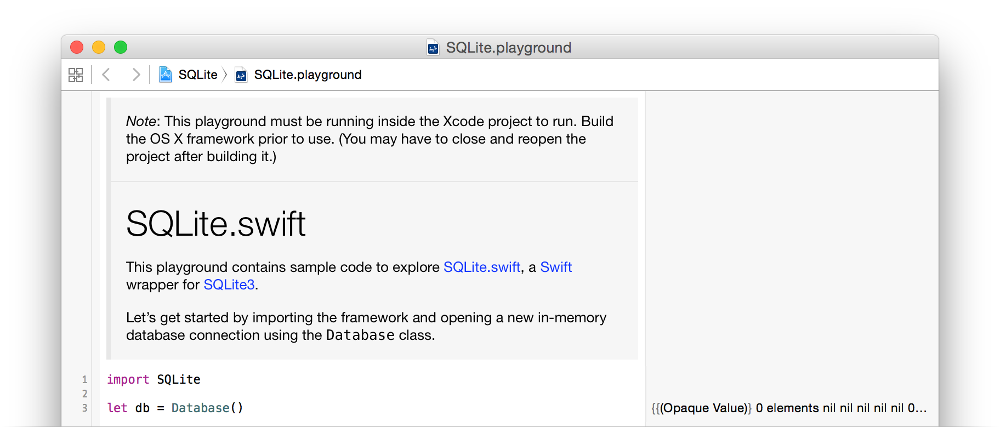

# SQLite.swift

[![Build Status][Badge]][Travis] [](http://cocoadocs.org/docsets/SQLite.swift) [](https://developer.apple.com/swift/) [](http://cocoadocs.org/docsets/SQLite.swift) [](https://github.com/Carthage/Carthage) [](https://gitter.im/stephencelis/SQLite.swift)

A type-safe, [Swift][]-language layer over [SQLite3][].

[SQLite.swift][] provides compile-time confidence in SQL statement
syntax _and_ intent.

[Badge]: https://img.shields.io/travis/stephencelis/SQLite.swift/master.svg?style=flat
[Travis]: https://travis-ci.org/stephencelis/SQLite.swift
[Swift]: https://developer.apple.com/swift/
[SQLite3]: http://www.sqlite.org
[SQLite.swift]: https://github.com/stephencelis/SQLite.swift


## Features

 - A pure-Swift interface
 - A type-safe, optional-aware SQL expression builder
 - A flexible, chainable, lazy-executing query layer
 - Automatically-typed data access
 - A lightweight, uncomplicated query and parameter binding interface
 - Developer-friendly error handling and debugging
 - [Full-text search][] support
 - [Well-documented][See Documentation]
 - Extensively tested
 - SQLCipher support via CocoaPods
 - Active support at [StackOverflow](http://stackoverflow.com/questions/tagged/sqlite.swift), and [Gitter Chat Room](https://gitter.im/stephencelis/SQLite.swift) (_experimental_)

[Full-text search]: Documentation/Index.md#full-text-search
[See Documentation]: Documentation/Index.md#sqliteswift-documentation


## Usage

``` swift
import SQLite

let db = try Connection("path/to/db.sqlite3")

let users = Table("users")
let id = Expression<Int64>("id")
let name = Expression<String?>("name")
let email = Expression<String>("email")

try db.run(users.create { t in
    t.column(id, primaryKey: true)
    t.column(name)
    t.column(email, unique: true)
})
// CREATE TABLE "users" (
//     "id" INTEGER PRIMARY KEY NOT NULL,
//     "name" TEXT,
//     "email" TEXT NOT NULL UNIQUE
// )

let insert = users.insert(name <- "Alice", email <- "alice@mac.com")
let rowid = try db.run(insert)
// INSERT INTO "users" ("name", "email") VALUES ('Alice', 'alice@mac.com')

for user in try db.prepare(users) {
    print("id: \(user[id]), name: \(user[name]), email: \(user[email])")
    // id: 1, name: Optional("Alice"), email: alice@mac.com
}
// SELECT * FROM "users"

let alice = users.filter(id == rowid)

try db.run(alice.update(email <- email.replace("mac.com", with: "me.com")))
// UPDATE "users" SET "email" = replace("email", 'mac.com', 'me.com')
// WHERE ("id" = 1)

try db.run(alice.delete())
// DELETE FROM "users" WHERE ("id" = 1)

db.scalar(users.count) // 0
// SELECT count(*) FROM "users"
```

SQLite.swift also works as a lightweight, Swift-friendly wrapper over the C
API.

``` swift
let stmt = try db.prepare("INSERT INTO users (email) VALUES (?)")
for email in ["betty@icloud.com", "cathy@icloud.com"] {
    try stmt.run(email)
}

db.totalChanges    // 3
db.changes         // 1
db.lastInsertRowid // 3

for row in try db.prepare("SELECT id, email FROM users") {
    print("id: \(row[0]), email: \(row[1])")
    // id: Optional(2), email: Optional("betty@icloud.com")
    // id: Optional(3), email: Optional("cathy@icloud.com")
}

db.scalar("SELECT count(*) FROM users") // 2
```

[Read the documentation][See Documentation] or explore more,
interactively, from the Xcode project’s playground.



For a more comprehensive example, see [this article](http://masteringswift.blogspot.com/2015/09/create-data-access-layer-with.html) and the [companion repository](https://github.com/hoffmanjon/SQLiteDataAccessLayer2/tree/master).

## Installation

> _Note:_ SQLite.swift requires Swift 3 (and [Xcode][] 8) or greater. If you absolutely
> need compatibility with Swift 2.3 you can use the [swift-2.3][] branch or older
> released versions. New development will happen exclusively on the master/Swift 3 branch.

### Carthage

[Carthage][] is a simple, decentralized dependency manager for Cocoa. To
install SQLite.swift with Carthage:

 1. Make sure Carthage is [installed][Carthage Installation].

 2. Update your Cartfile to include the following:

    ```
    github "stephencelis/SQLite.swift" ~> 0.11.2
    ```

 3. Run `carthage update` and [add the appropriate framework][Carthage Usage].


[Carthage]: https://github.com/Carthage/Carthage
[Carthage Installation]: https://github.com/Carthage/Carthage#installing-carthage
[Carthage Usage]: https://github.com/Carthage/Carthage#adding-frameworks-to-an-application


### CocoaPods

[CocoaPods][] is a dependency manager for Cocoa projects. To install
SQLite.swift with CocoaPods:

 1. Verify that your copy of Xcode is installed and active in the default location (`/Applications/Xcode.app`).

    ```sh
    sudo xcode-select --switch /Applications/Xcode.app
    ```

 2. Make sure CocoaPods is [installed][CocoaPods Installation]. (SQLite.swift requires version 1.0.0 or greater.)

    ``` sh
    # Using the default Ruby install will require you to use sudo when
    # installing and updating gems.
    [sudo] gem install cocoapods
    ```

 3. Update your Podfile to include the following:

    ``` ruby
    use_frameworks!

    target 'YourAppTargetName' do
        pod 'SQLite.swift', '~> 0.11.2'
    end
    ```

 4. Run `pod install --repo-update`.

[CocoaPods]: https://cocoapods.org
[CocoaPods Installation]: https://guides.cocoapods.org/using/getting-started.html#getting-started

### Swift Package Manager

The [Swift Package Manager][] is a tool for managing the distribution of Swift code.

1. Add the following to your `Package.swift` file:

```swift
dependencies: [
    .Package(url: "https://github.com/stephencelis/SQLite.swift.git", majorVersion: 0, minor: 11)
]
```

[Swift Package Manager]: https://swift.org/package-manager

### Manual

To install SQLite.swift as an Xcode sub-project:

 1. Drag the **SQLite.xcodeproj** file into your own project.
    ([Submodule][], clone, or [download][] the project first.)

    

 2. In your target’s **General** tab, click the **+** button under **Linked
    Frameworks and Libraries**.

 3. Select the appropriate **SQLite.framework** for your platform.

 4. **Add**.

Some additional steps are required to install the application on an actual device:

 5. In the **General** tab, click the **+** button under **Embedded Binaries**.

 6. Select the appropriate **SQLite.framework** for your platform.

 7. **Add**.


[Xcode]: https://developer.apple.com/xcode/downloads/
[Submodule]: http://git-scm.com/book/en/Git-Tools-Submodules
[download]: https://github.com/stephencelis/SQLite.swift/archive/master.zip


## Communication

[See the planning document] for a roadmap and existing feature requests.

[Read the contributing guidelines][]. The _TL;DR_ (but please; _R_):

 - Need **help** or have a **general question**? [Ask on Stack
   Overflow][] (tag `sqlite.swift`).
 - Found a **bug** or have a **feature request**? [Open an issue][].
 - Want to **contribute**? [Submit a pull request][].

[See the planning document]: /Documentation/Planning.md
[Read the contributing guidelines]: ./CONTRIBUTING.md#contributing
[Ask on Stack Overflow]: http://stackoverflow.com/questions/tagged/sqlite.swift
[Open an issue]: https://github.com/stephencelis/SQLite.swift/issues/new
[Submit a pull request]: https://github.com/stephencelis/SQLite.swift/fork


## Author

 - [Stephen Celis](mailto:stephen@stephencelis.com)
   ([@stephencelis](https://twitter.com/stephencelis))


## License

SQLite.swift is available under the MIT license. See [the LICENSE
file](./LICENSE.txt) for more information.

## Related

These projects enhance or use SQLite.swift:

 - [SQLiteMigrationManager.swift](https://github.com/garriguv/SQLiteMigrationManager.swift) (inspired by [FMDBMigrationManager](https://github.com/layerhq/FMDBMigrationManager))


## Alternatives

Looking for something else? Try another Swift wrapper (or [FMDB][]):

 - [Camembert](https://github.com/remirobert/Camembert)
 - [GRDB](https://github.com/groue/GRDB.swift)
 - [SQLiteDB](https://github.com/FahimF/SQLiteDB)
 - [Squeal](https://github.com/nerdyc/Squeal)
 - [SwiftData](https://github.com/ryanfowler/SwiftData)
 - [SwiftSQLite](https://github.com/chrismsimpson/SwiftSQLite)

[FMDB]: https://github.com/ccgus/fmdb
[swift-2.3]: https://github.com/stephencelis/SQLite.swift/tree/swift-2.3
