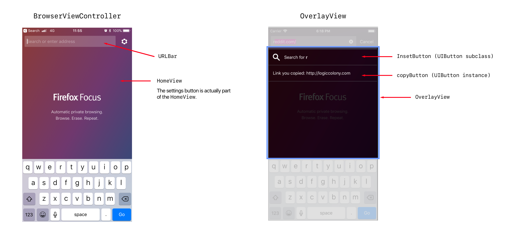
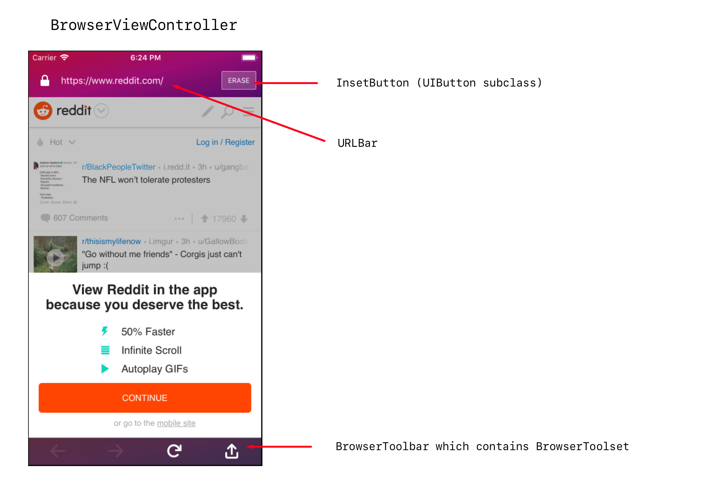
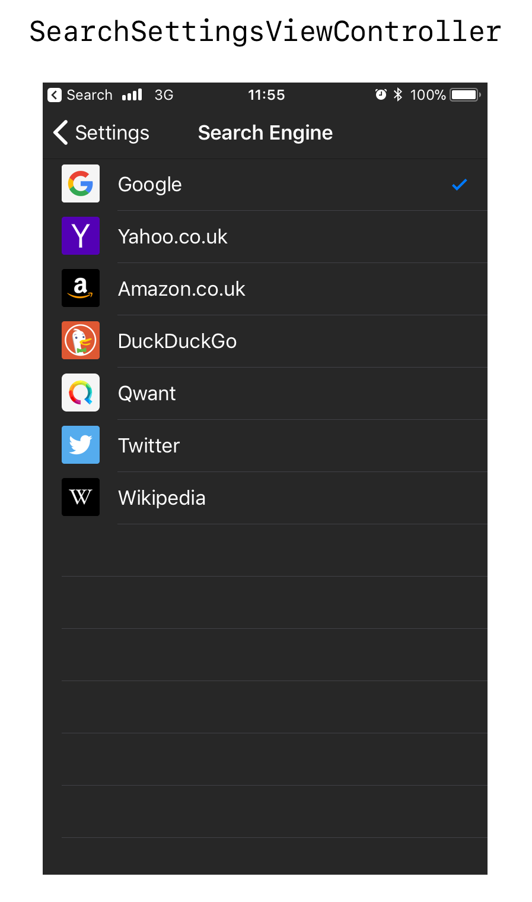

# What is this Document?

This document serves as a map to the code and UI elements of the Firefox Focus app for iOS.

It aims to make it easy to get a high level overview of the code, and see which parts of the code relate to which parts of the app.

There are many details of the code that are omitted from this document! This is by design - view this as a map to help start your explorations of the code base.

Happy hacking!

## Revision History

|Date|Changes|Author|
|:--|:------|--:|
|12-Oct-2017 | Initial Revision. | [@Krishna](https://github.com/Krishna)|

## Splash Screen

The Splash Screen animates out at start up.

See: ```AppDelegate displaySplashAnimation()```

The Splash Screen view is shown again when the app is sent to the background. This ensures Focus’s browser view is not viewable from the iOS task switching functionality. (This is a privacy safeguard).

The Splash Screen view is hidden again when Focus becomes the active app. 

## The App's Root View Controller

The root view controller of the app is a standard Navigation Controller (```UINavigationController```).

And the root view controller of the Navigation Controller is an instance of ```BrowserViewController```.

```BrowserViewController``` hides the navigation bar in its ```viewWillAppear()``` method.

## FirstRunViewController

  

If it’s the first run of the app, an instance of ```FirstRunViewController``` is presented.


## BrowserViewController - no web page loaded

  


```BrowserViewController``` works by  displaying an instance of ```HomeView``` (when no web page is loaded). 

When the user enters input in the ```URLBar```, an ```OverlayView``` is presented.

Finally, when the user initiates a search or enters a valid URL, ```BrowserViewController``` will display its ```WebViewContainer``` (which does view containment on a ```WebViewController``` instance).


## OverlayView

```OverlayView``` is presented when the user has begun entering data into the ```URLBar```.

As the user types (or pastes in input that is not a complete URL), an instance of ```InsetButton``` is displayed. 

If the user pastes in a URL, the ```copyButton``` is displayed.

When the user enters input in the ```URLBar```, an ```OverlayView``` is presented.

## BrowserViewController - web page loaded

  


```BrowserViewController``` will display its ```WebViewContainer``` once it has a valid URL or a search to perform.

```WebViewContainer``` is showing the view controlled by ```WebViewController```.


## Other ViewControllers

  

---

  

---

